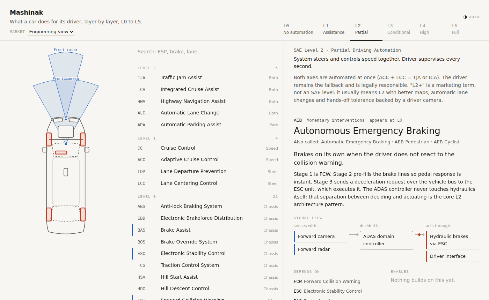
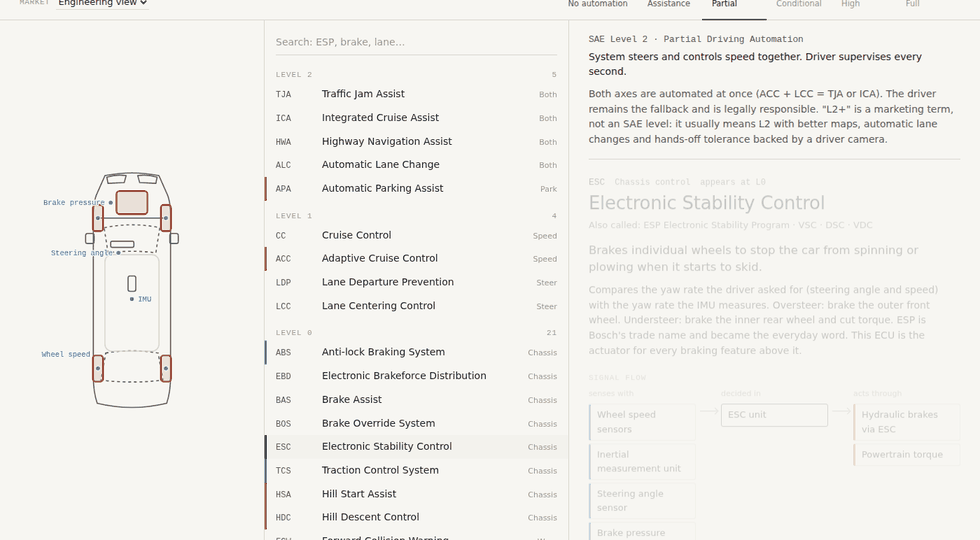

# Mashinak

**An interactive map of what a car does for its driver, from SAE Level 0 to Level 5.**

Live: **https://mersious.github.io/Mashinak/**



Car brochures list driver-assistance features as a flat wall of acronyms: ESP, EBA, HAC,
TJA, ICA. Mashinak turns that wall into a structure you can click through. Pick a level,
pick a feature, and see what it senses, where the decision is made, what it moves, and
which other features it depends on.

It exists because engineers join automotive projects every day without ever having been
told what ESC actually is.

## What you can do with it



- **Walk the levels.** L0 to L5 follow SAE J3016. Switching to L2 shows everything a real
  L2 car carries, highest level first. Each level explains who drives and who is responsible.
- **Read a feature.** One line summary, a longer explanation, aliases used by different brands,
  and the standards behind it.
- **Follow the signal.** Every feature is drawn as *senses with → decided in → acts through*.
  This is the part brochures hide: AEB does not brake, it asks the ESC unit to brake.
- **See it on the car.** A top-down blueprint shows sensor coverage in blue and actuators in
  red. With nothing selected it doubles as a "where does a car carry its sensors" reference.
- **Trace dependencies.** *Depends on* and *Enables* are clickable, and the feature list marks
  them in blue and red while a feature is selected.
- **Switch market.** The Global view is pure engineering. EU, US and CN add the regulatory
  regime per level and, for each feature that differs, whether it is mandatory, phasing in,
  rated, permitted or pilot only, with the rule numbers.
- **Share a view.** The URL carries the state: `#L2/AEB`, `#eu/L3/ALKS`.

Keyboard: `↑` `↓` walk the list, `0` to `5` switch level. Theme follows your system and can
be forced light or dark from the top right. Works on phones.

## Run it locally

```sh
git clone https://github.com/mersious/Mashinak
cd Mashinak
npm install
npm run dev
```

`npm run build` writes a static site to `dist/`. No backend, no tracking, no runtime
dependencies beyond React.

## How the data is organised

Everything the app shows lives in `src/data/`. Adding or correcting a feature is a data
change, not a code change.

| File | Holds |
|---|---|
| `types.ts` | Vocabularies as string-literal unions: feature ids, sensors, actuators, controllers, markets |
| `vocab.ts` | Human descriptions of levels, categories, sensors, actuators, controllers and markets |
| `features.ts` | One record per feature: level, sensors, actuators, controller, dependencies, standards, text |
| `markets.ts` | Per-market status, rules and notes for the features that differ by region |

Because the ids are types, a typo in a dependency fails `npm run build` instead of silently
breaking the graph.

Conventions for data:

- Feature names are generic. Brand and supplier names (ESP, ASR, Drive Pilot) go in `aliases`.
- Cite a regulation or standard where one exists. No marketing prose.
- Dates in market notes refer to new passenger cars unless stated.

## Branches and releases

- `main` is the released site at the root URL. Tagged with [semantic versions](https://semver.org).
- `dev` is staging, deployed to `/dev/` by the same workflow.
- Changes are listed in [CHANGELOG.md](CHANGELOG.md).

Corrections and additions are welcome as issues or pull requests against `dev`.

## Sources

SAE J3016; UN Regulations R13-H, R79, R130, R140, R152, R157 and R171; EU General Safety
Regulation 2019/2144 and its delegated acts; FMVSS 111, 126, 127 and 135; GB 7258 and the
GB/T ADAS standards including GB/T 39263-2020 and GB/T 40429-2021; Euro NCAP, NHTSA NCAP,
IIHS and C-NCAP protocols; ISO 15622, 17387, 23374.

## Name

Mashinak (ماشینک) is Persian for "little car".
